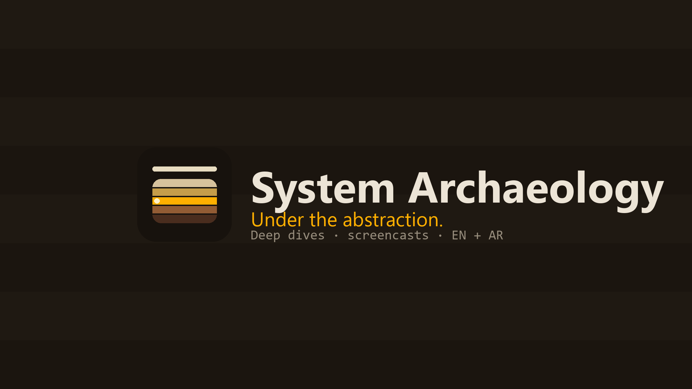

# System Archaeology

### Under the abstraction.

---

Every tool gives you a clean surface — a command, a button, a page of docs. But under that
surface, something is *actually* happening: processes, packets, syscalls, files, bytes.
**That's the dig site.**

We investigate systems the way archaeologists uncover the layers of a civilization — going
past the API, the command, the GUI, and the documentation to show what is really happening
underneath, layer by layer.

**Linux / Unix · Windows internals · programming · the cloud · AI** — in screen-first deep dives.

### Where to find us

- ▶️ **YouTube** — [@SystemArchaeology](https://youtube.com/@SystemArchaeology) · deep dives & screencasts (EN + AR)
- ✍️ **Writing & tools** — [abdelhaleemahmed.github.io](https://abdelhaleemahmed.github.io)

### Tools we build and use

- **[servewise](https://github.com/abdelhaleemahmed/servewise)** — a tiny, dependency-free local
  preview server that tells you the truth: caching off by default, safe port selection, and it
  audits its own version so you never silently serve the wrong build.
- **slimv** — a Python A/V re-encoding toolkit for shrinking and verifying recordings without
  trusting the file size alone.

---

### بالعربية

كل أداة تمنحك سطحاً أنيقاً: أمرٌ، أو زِر، أو صفحة توثيق. لكن تحت هذا السطح يحدث شيءٌ *فعلاً* —
عمليات، وحِزَم، واستدعاءات نظام، وملفات، وبايتات. هذا هو موقع التنقيب.

نُنقّب في الأنظمة كما يكشف علماء الآثار طبقات حضارةٍ قديمة: نتجاوز الواجهة البرمجية والأمر
والواجهة الرسومية والتوثيق لنُظهر ما يحدث حقاً في الأسفل. لينكس/يونكس، وأعماق ويندوز، والبرمجة،
والحوسبة السحابية، والذكاء الاصطناعي — في شروحاتٍ عملية تبدأ من الشاشة.

---

<code>$ under --the-abstraction</code>

